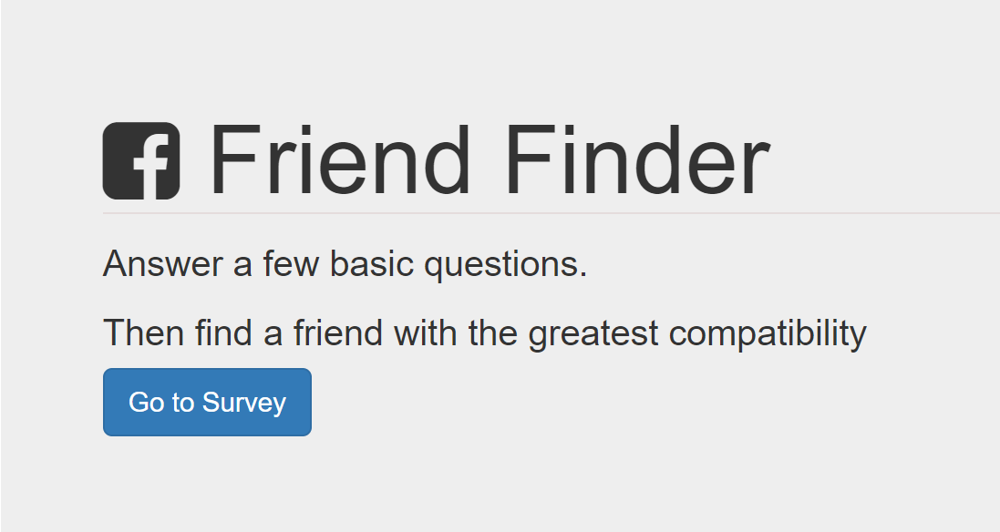

# FriendFinder

FriendFinder is an application that asks users to answer ten survey questions to find their best friend. After submitting their survey, users are added to the database of friends and given their best match. 

### Prerequisites

What things you need to install the software and how to install them

```
NPM Packages:
express
path
body-parser
```
use "npm install packageName --save" in terminal to run application on your localhost:3000 webpage

### App Demo


####User completes a short survey.

####User must enter their name and link to an image before submitting.

####After hitting submit, user is given a best friend based on a combination of input.

####User is added to the database of friends to be a potential match for the next user. All noncoupled users are deleted when the server is restarted.

## Authors

* **Cecily Grossmann** (https://github.com/grssmnn2)